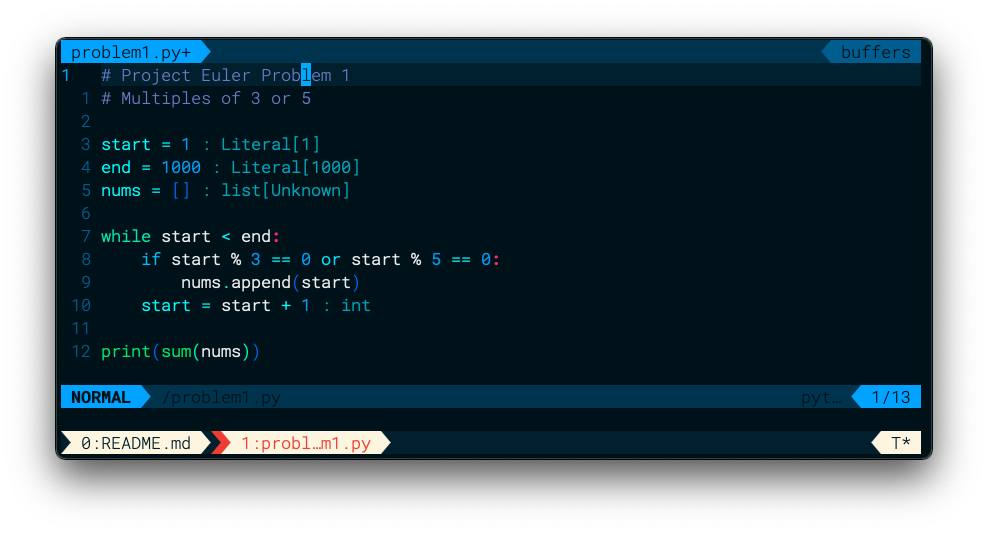
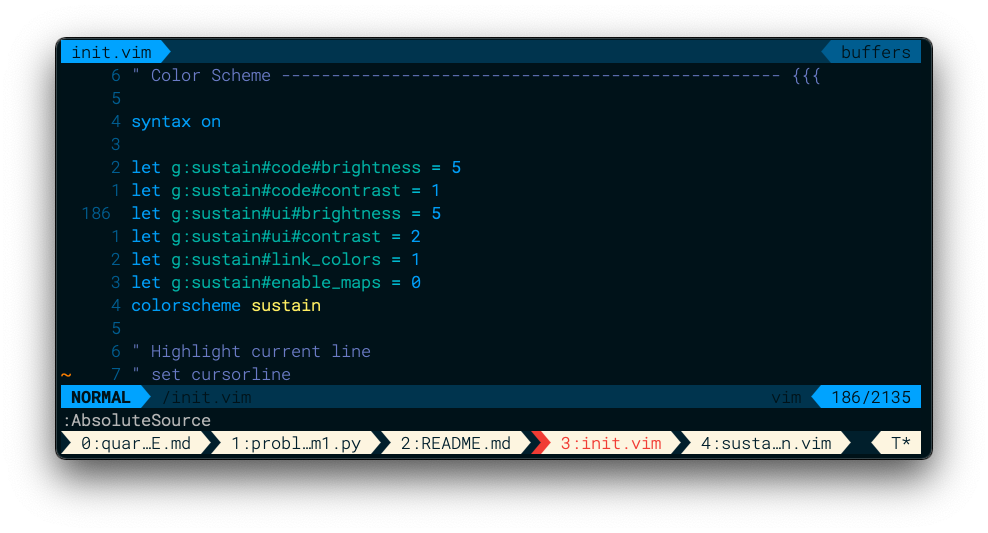
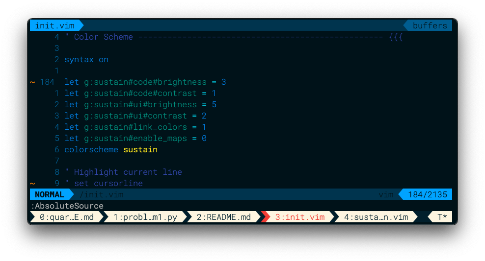
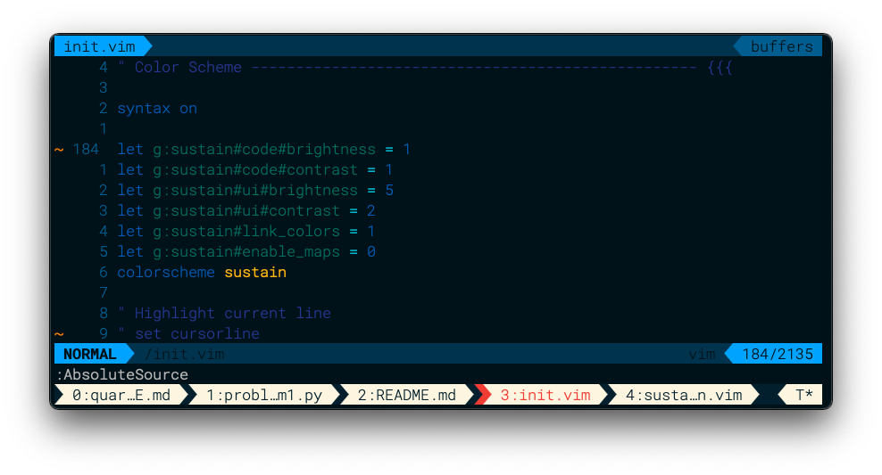
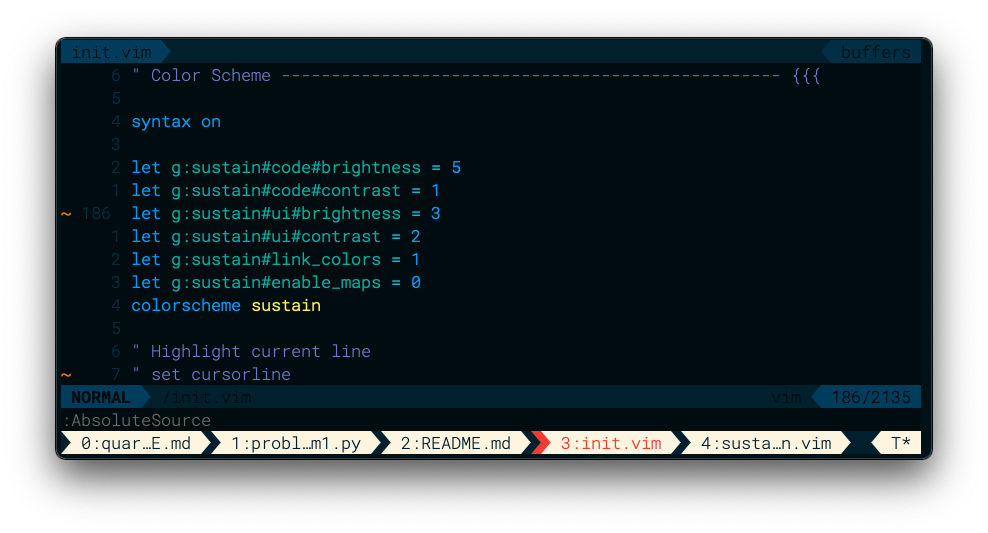
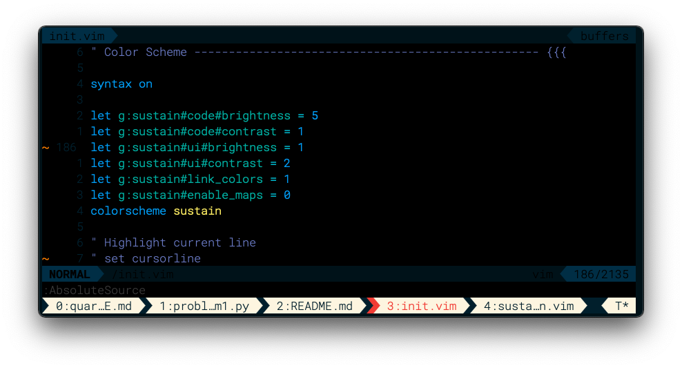

# Sustain

Sustain is a customizable neovim/vim colorscheme that uses material design as a framework for syntax highlight and ui color customization.



## Motivation

Material design defines a set of colors with similar contrast ratios at different shades. This colorscheme leverages these colors to provide syntax highlighting that "looks" the same for different colors. Having a standard of colors allows for brightness and contrast of both the code and ui syntax to be customized. This colorscheme exposes brightness and contrast settings for code and ui which are configured in the vim configuration file `init.vim`. These variables allow the entire colorscheme to be changed to different brightness or contrast settings without changing any individual colors.

## Examples

Below are examples of code brightness customization with sustain using `g:sustain#code#brightness`:







Examples of UI brightness customization using `g:sustain#ui#brightness`:





## Installation

Use your preferred plugin manager to install from the source: <https://github.com/simmsa/sustain>

Example installation using `vimplug`

```vim
Plug 'simmsa/sustain'
```

## Required Settings

```vim
syntax on
" Place sustain configurations/customizations here
colorscheme sustain
```

## Configuration

```vim
let g:sustain#code#brightness = 5
let g:sustain#code#contrast = 1
let g:sustain#ui#brightness = 5
let g:sustain#ui#contrast = 2
let g:sustain#link_colors = 1
let g:sustain#enable_maps = 0

" Highlight current line
set cursorline

sign define numhl=SignColumn

colorscheme sustain
```
